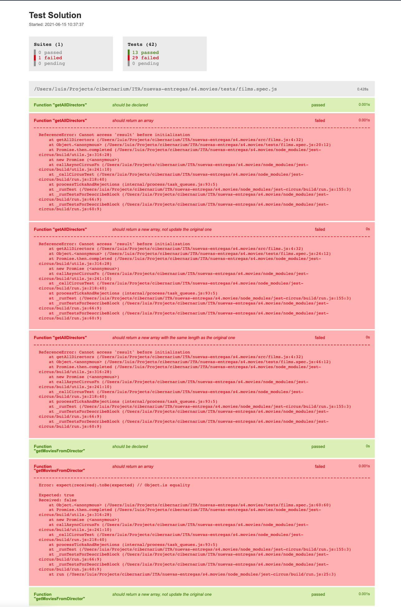
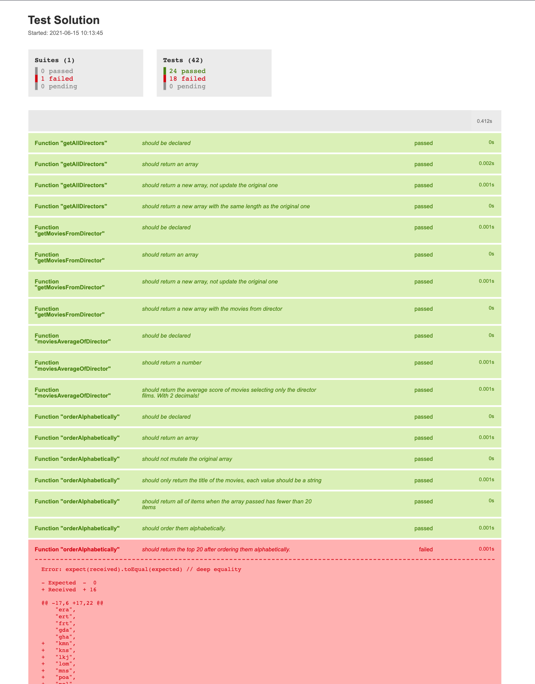
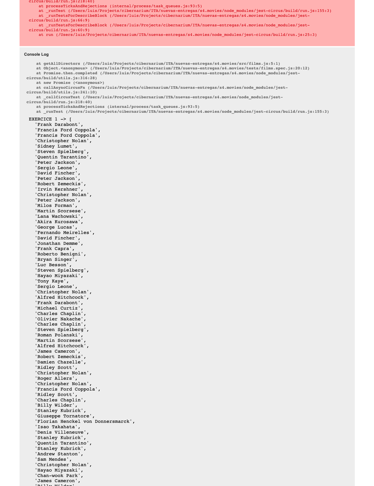

# SPRINT 4. JAVASCRIPT 2 (ES6)

###### Sumari

- Objectius

- Part Teòrica
  
  - Curs ES6
  
  - Git: com fer un pull request

- Part Pràctica. S4. Movies.

---

## OBJECTIUS

##### **Objectius generals**

- Comprendre els beneficis generats pels canvis a la programació de JavaScript versió ES6.
- Programar les primeres funcionalitats a ES6.

##### **Objectius específics**

- Aprendre a declarar funcions fletxa.
- Entendre la potència i començar a utilitzar els nous iteradors ES6 per manipular dades amb menys codi.
- Escriure codi asíncron amb async/await.

---

## PART TEÒRICA

### CURS ES6

En aquest curs aprendràs els conceptes fonamentals de Javascript modern **(ES6)**

#### Què és ES6

ECMAScript 6, també conegut com a ECMAScript 2015 o ES6, és la nova versió de JavaScript, aprovada al juny 2015, i en la que es porta treballant des del 2011.

Es podria considerar que és una autèntica revolució a la sintaxi de JavaScript. El seu vaixell insígnia és, probablement, una clara orientació a classes i herència, però la veritat és que hi ha moltes altres novetats interessants, com ara l'ús de mòduls, els paràmetres per defecte, les variables let i const, o la nova sintaxi de les funcions arrow, entre altres canvis.

 **Per saber més**

- Youtube - Falcon Masters - Curso de ES6 - Que es ECMASCRIPT en 2 MINUTOS: [Curso de ES6.- Que Es ECMASCRIPT EN 2 MINUTOS. - YouTube](https://www.youtube.com/watch?v=LWiMWZ9-cdw)

- Youtube - Ada Lovecode - Didacticode - CURSO JAVASCRIPT MODERNO (ES6 ESENCIAL) - #00. Introdución: [CURSO JAVASCRIPT MODERNO (ES6 ESENCIAL) - #00. Introducción - YouTube](https://www.youtube.com/watch?v=bPmdUIq4y80)

#### Conceptes fonamentals ES6

##### Curs ES6 a través de mini vídeos

Si has entès JavaScript, no et costarà entendre els conceptes d'ES6.

A continuació et proporcionem les dues llistes de reproducció de YouTube, compostes de mini vídeos, que expliquen els conceptes fonamentals d'ES6:

**-> [Curso de ECMASCRIPT 6 (ES6)](https://www.youtube.com/playlist?list=PLhSj3UTs2_yX_ct0OfHrmMwKL8wpz-N2j)**  
**-> [Curso JavasCript Moderno (ES6 ESENCIAL)](https://www.youtube.com/playlist?list=PLI7nHlOIIPOIBIHhyj_wtSs_Wk4lKTxdL)  
**  

Tria la que més t'agradi. També és bona idea combinar-les, si no entens bé un concepte, pots acudir a l'altra llista de reproducció per a tenir un altre punt de vista.

##### Curs complet en un únic vídeo

Si per la teva manera d'aprenentatge, t'encaixa més seguir un únic vídeo, a continuació tens l'explicació d'ES6: [ES6 Tutorial: Learn Modern JavaScript in 1 Hour - YouTube](https://www.youtube.com/watch?v=NCwa_xi0Uuc)

#### Resum ES6

A continuació tens un resum d'ES6 a mode de repàs:

**->[Link a resum ES6](https://flaviocopes.com/es6/)**

#### Cursos ES6

Com a complement a l'anterior apartat, a continuació tens diversos cursos en els quals podràs anar aplicant cadascun dels conceptes apresos:

**->[Curs Scrimba "](https://scrimba.com/learn/introtoes6)**

**->[Introduction to ES6+](https://scrimba.com/learn/introtoes6)**

**->[Curs JavaScript d'Exercism](https://exercism.org/tracks/javascript)**

#### A practicar ES6!

És molt important que aprenguis a aplicar els coneixements apresos en un projecte.

A continuació tens un exemple complet de com desenvolupar una aplicació usant ES6:

[Build A Calculator With JavaScript Tutorial - YouTube](https://www.youtube.com/watch?v=j59qQ7YWLxw)

### GIT: COM FER UN PULL REQUEST

### Curs d'introducció a Git

En el següent vídeo visualitzaràs un curs, en castellà, d'introducció a Git.

[1.- Curso Git - Introducción a Git - YouTube](https://www.youtube.com/watch?v=zH3I1DZNovk)

### Git: guia senzilla i visual

Una guia senzilla per començar amb Git sense complicacions.

**->[Git - la guía sencilla](https://rogerdudler.github.io/git-guide/index.es.html)**  

### Git: blog com fer un Pull Request

En el següent vídeo s'explica com fer un Pull Request, per sol·licitar que un col·laborador/a validi els canvis que hem fet en el codi font.

[Pull Request - YouTube](https://www.youtube.com/watch?v=w_dsU0NlKe0)

### Git Flow

Resum de Git Flow en 5 minuts:

**->[Qué es Git flow y cómo funciona](https://cleventy.com/que-es-git-flow-y-como-funciona/#:~:text=Es%20ah%C3%AD%20donde%20entra%20en,a%20los%20lanzamientos%20del%20proyecto.)**

Entenent el Git Flow: com fer pull request:

**->[Understanding the Git flow](https://waydev.co/understanding-the-git-flow/)**

----

## PART PRÀCTICA. S4. MOVIES.

### Objectius

- Posar en prácitca els conceptes d'ES6.
- Aprendre a manipular un set de dades.
- Dividir el nostre codi en funcions, i saber reutilitzar-les.

## Descripció

ENHORABONA! En aquest sprint has après molts mètodes i funcionalitats de JavaScript que t'aporta ES6 (6 ja que és la 6a versió d'aquest llenguatge, també anomenat ECMAScript2015 pel seu any de publicació).

En aquest lliurament ho posarem en pràctica, perquè ens ofereix opcions per a reduir codi i augmentar la llegibilitat del desenvolupament.

**Una empresa del sector audiovisual ens ha demanat una aplicació web, que li permeti als seus empleats trobar ràpidament pel·lícules d'una gran base de dades que posseeixen**, perquè el procés actualment es realitza de manera manual.

Seràs l'encarregat de muntar el core de l'aplicació: tota la lògica de filtratge i ordenament de pel·lícules. Tens 2 setmanes de termini, que és el que dura aquest sprint.  

#### Notes

Tens les següents indicacions del responsable front end:  

- Se t'ha preparat la base del projecte sobre la qual treballar:

**->[GitHub - IT-Academy-BCN/starter-code-frontend-sprint-4](https://github.com/IT-Academy-BCN/starter-code-frontend-sprint-4)**

- És **obligatori implementar tots els bucles en ES6** (usant map, reduce, filter i sort per a manipular arrays).

- Com que de moment no consumim dades d'un servidor fent servir una API, **treballarem amb dades de l'arxiu src/data.js**. De moment implementarem la lògica fent servir un array d'informació sobre 250 pel·lícules.

- El **lliurament ha de processar aquest array de pel·lícules, per a mostrar-ho com es demana en cada exercici.**

**-** La **lògica** a implementar l'hauràs de posar en l'arxiu **src/films.js.**

-  No fa falta mostrar el resultat de cada funció per pantalla. **El teu objectiu és superar els tests**.  Tens més informació de com programar orientat a superar tests al final del document

- Que no se t'oblidi **incloure la captura dels resultats dels tests** al campus virtual.

- **Est****à prohibit copiar el codi**, ja que d'aquesta manera no s'aprèn res. A més com podràs observar, després del lliurament de l'sprint 5 hi ha una mini prova de nivell amb el mentor/a, on hauràs de demostrar en directe que has adquirit els conceptes de JavaScript. No et preocupis, si treballes els lliuraments, la superaràs sense problemes.

#### Informació de les dades a manipular

Tens un array de 250 pel·lícules a l'arxiu src/data.js. Cada element de l'array és un objecte que conté la informació de cada pel·lícula. A continuació es mostra un exemple d'una pel·lícula d'aquest array:

{

"title": "Pulp Fiction",

"year": 1994,

"director": "Quentin Tarantino",

"duration": "2h 34min",

"genre": ["Crime","Drama"],

"rate": 8.9

},

#### Testing

Per a ajudar-te a desenvolupar el projecte, l'arquitecte web t'ha preparat uns tests, perquè sàpigues de manera ràpida si el teu codi està funcionant correctament, i evitar possibles bugs en el futur.

Per a fer ús d'aquests tests, has d'instal·lar el test Runner mitjançant el comando:

**npm Install**

Després, podràs executar fàcilment els tests mitjançant el comando:

**npm run test:watch**

En executar aquest últim comando, se't generarà un arxiu test-results.html. Simplement, ho has d'obrir al navegador per veure els resultats dels tests! (Es recomana obrir aquest html amb el plugin “Live Server” de VSCode)

## Nivell 1

### - Exercici 1

**S'ha de mostrar per pantalla a l'usuari/ària només els directors de les pel·lícules.** 

Per obtenir l'array de directors/es, has de crear la funció **getAllDirectors**().

No has de fer el renderitzat del resultat en aquesta funció, ha de retornar l'array de directors. L'objectiu és mantenir cada funció amb una única responsabilitat.

**Ajuda:** hauràs d'implementar un bucle.map que recorri tot l'array de pel·lícules, extraient només el camp director de cadascuna (no oblidis que cada pel·lícula és un objecte, que conté el camp que ens interessa "director").  

### - Exercici 2

Una altra funcionalitat necessària és mostrar les pel·lícules per a un determinat director/a.  
Per a això, hauràs de crear una funció getMoviesFromDirector(). 

Aquesta funció ha de **rebre com a paràmetre el/la director/a** per al qual es volen buscar les seves pel·lícules, i **retorna l'array de pel·lícules que ha dirigit.**

**Ajuda:** és recomanable usar el mètode .filter().

### - Exercici 3

Genial!, ja tens l'array de pel·lícules per a un/a determinat/da director/a.

Per a tenir més informació d'aquest/a director/a, es demana calcular la mitjana de les puntuacions de les seves pel·lícules.

Per a això, hauràs d'implementar **la funció moviesAverage(),** la qual rep un array de pel·lícules i **retorna la nota mitjana, amb dos decimals.**

**Ajuda:** com vols obtenir un únic valor, el mètode .reduce() pot ser d'utilitat.

### 

### - Exercici 4

ENHORABONA!, ja tens creats tots els filtres que permetran extreure tota la informació necessària sobre els/les directors/es!

Ara en aquest exercici i el següent implementaràs la lògica per a ordenar les pel·lícules, part fonamental en qualsevol eina de visualització de dades.

En aquest apartat, **hauràs de crear una funció, que rebent un array de pel·lícules, el retorni ordenat alfabèticament per títol.**

Només s'han de **retornar les 20 primeres pel·lícules** ordenades.

**Ajuda:** Per a saber si has de retornar un array amb tota la informació de les pel·lícules o un array que contingui només el nom de les pel·lícules, analitza l'arxiu amb els tests anomenat "films.spec.js" i revisa els tests de l'exercici 4.  

### - Exercici 5

Ja només et falta una segona funció que ordeni les pel·lícules.  

En aquesta ocasió, hauràs d'implementar una **funció que rebent un array de pel·lícules, retorna un array de pel·lícules ordenades per any.**

Com podràs observar, hi ha moltes pel·lícules que coincideixen en un mateix any. **Per a ordenar aquestes pel·lícules que tenen el mateix any, s'ha de fer per ordre alfabètic del títol.**

### - Exercici 6

Ho estàs fent molt bé, ja has creat una aplicació web amb moltes eines que podran ajudar als usuaris/àries!

En aquest apartat, és necessari donar la possibilitat als usuaris/àries de demanar la nota mitjana de les pel·lícules d'un determinat gènere.

Hauràs de crear una **funció que rebi una categoria de pel·lícula,  i calculi la mitjana de nota d'aquesta categoria** (sobre l'array de totes les pel·lícules).

Per a facilitar-te la implementació, hauràs d'usar la funció creada en l'exercici 3. Primer has d'obtenir les pel·lícules d'una determinada categoria, i després cridar a moviesAverage(), per a calcular la seva mitjana.  
Aquí radica la potència de les funcions, pots reutilitzar-les tantes vegades com vulguis!

## Nivell 2

COMPTE!, **abans de passar al nivell 2 verifica que has entès bé tots els exercicis del nivell 1**.   

El nivell 2 i 3 són opcionals, l'important és aprendre els conceptes de cada sprint, si l'has copiat ràpid d'internet no té valor, ja que si passes així tots els sprints, hauràs treballat molt i après poc. 

En una entrevista tècnica a una empresa o a les proves de nivell de l'itinerari (després del sprint 5 i 9) es detecta molt ràpid aquests casos. No retardis el teu aprenentatge, **millor fer pocs exercicis bé que molts ràpids.**

### 

### - Exercici 7

Com hauràs pogut observar, la durada de les pel·lícules de l'array ve en hores i minuts.  
Això és un problema per a comparar-les fàcilment, per la qual cosa hauràs de modificar aquest format de durada.  

Has de crear una **funció on rebent un array de pel·lícules, retorna un array amb aquestes pel·lícules però amb la durada en minuts!**  

Per exemple:

| {   |
| --- | --- |
|     | title: 'Pulp Fiction', |
|     | year: 1994, |
|     | director: 'Quentin Tarantino', |
|     | duration: '2h 34min', |
|     | genre: ['Crime', 'Drama'], |
|     | score: 8.9 |
|     | },  |

Es tranformaría en:

| {   |
| --- | --- |
|     | title: 'Pulp Fiction', |
|     | year: 1994, |
|     | director: 'Quentin Tarantino', |
|     | duration: '154', |
|     | genre: ['Crime', 'Drama'], |
|     | score: 8.9 |
|     | },  |

## Nivell 3

### - Exercici 8

Ja estàs arribant al final, només fa falta implementar una última funcionalitat!

Els usuaris/àries necessiten saber quina pel·lícula és la millor de cada any. Per dur a terme aquesta funcionalitat, **hauràs de crear una funció que accepti l'any, i retorni la millor pel·lícula d'aquest any.**

Annex I: Programar per a satisfer tests  

En aquest lliurament, **no has de programar per mostrar per pantalla un resultat**, sinó que has d'anar superant una sèrie de tests.  

Com es fa això? Perquè és molt senzill, al començament, com que no tens cap funció feta, t'apareixeran tots els tests en vermell (segons no s'han passat), i a mesura que vagi completant les funcions, veuràs que els resultats dels tests es canvien a color verd!

En executar el comando 

npm run test:watch

veuràs que **automàticament es genera l'arxiu "test-results.html"** al teu projecte. Aquest arxiu, com veus és HTML, et **mostra visualment els resultats dels tests i els console.log()** que hagis inclòs en el teu codi.

En **obrir aquest HTML** (el millor és **usar el plugin live server de visual code,** perquè d'aquesta manera, quan facis canvis, s'actualitzi actualment la web), veuràs aquest resultat:

No et preocupis en veure-ho tot vermell, és normal, a poc a poc aniràs passant tots els tests a verd.  

Un exemple de **com ha d'anar quedant els tests quan els vas superant**:  

  

****Atenció, presta molta atenció al que indica cada test, dona pistes de què està fallant!! ****

****A vegades, si necessites més informació a part dels resultats dels tests, pots posar console.log() en el teu codi, i aquests apareixeran en la part inferior de l'arxiu "test-results.html":

  

Amb l'enunciat, els resultats dels tests i els console.log() tens més que suficient per a efectuar tot el lliurament. Al principi és una mica diferent programar per a satisfer el test, però després veuràs que és molt còmode.

---

#### Criteris de qualificació

Exercici 1 (N.1) getAllDirectors()

|                           |                                                                        |                                                             |
| ------------------------- | ---------------------------------------------------------------------- | ----------------------------------------------------------- |
| No funciona  0punts | Funciona sense ser implementada com l'enunciat indica  0.75punts | Funciona amb la implementació sol·licitada  1.25punts |

Exercici 2 (N.1) getMoviesFromDirector()

| No funciona  0punts | Funciona sense ser implementada com l'enunciat indica  0.75punts | Funciona amb la implementació sol·licitada  1.25punts |
| ------------------------- | ---------------------------------------------------------------------- | ----------------------------------------------------------- |

Exercici 3 (N.1) moviesAverageOfDirector()

| No funciona  0punts | Funciona sense ser implementada com l'enunciat indica  0.75punts | Funciona amb la implementació sol·licitada  1.25punts |
| ------------------------- | ---------------------------------------------------------------------- | ----------------------------------------------------------- |

Exercici 4 (N.1) orderAlphabetically()

| No funciona  0punts | Funciona sense ser implementada com l'enunciat indica  0.75punts | Funciona amb la implementació sol·licitada  1.25punts |
| ------------------------- | ---------------------------------------------------------------------- | ----------------------------------------------------------- |

Exercici 5 (N.1) orderByYear()

| No funciona  0punts | Funciona sense ser implementada com l'enunciat indica  0.75punts | Funciona amb la implementació sol·licitada  1.25punts |
| ------------------------- | ---------------------------------------------------------------------- | ----------------------------------------------------------- |

Exercici 6 (N.1) moviesAverageByCategory()

| No funciona  0punts | Funciona sense ser implementada com l'enunciat indica  0.75punts | Funciona amb la implementació sol·licitada  1.25punts |
| ------------------------- | ---------------------------------------------------------------------- | ----------------------------------------------------------- |

Exercici 7 (N.2) hoursToMinutes()

| No funciona  0punts | Funciona sense ser implementada com l'enunciat indica  0.75punts | Funciona amb la implementació sol·licitada  1.25punts |
| ------------------------- | ---------------------------------------------------------------------- | ----------------------------------------------------------- |

Exercici 8 (N.3) bestFilmOfYear()

| No funciona  0punts | Funciona sense ser implementada com l'enunciat indica  0.75punts | Funciona amb la implementació sol·licitada  1.25punts |
| ------------------------- | ---------------------------------------------------------------------- | ----------------------------------------------------------- |
